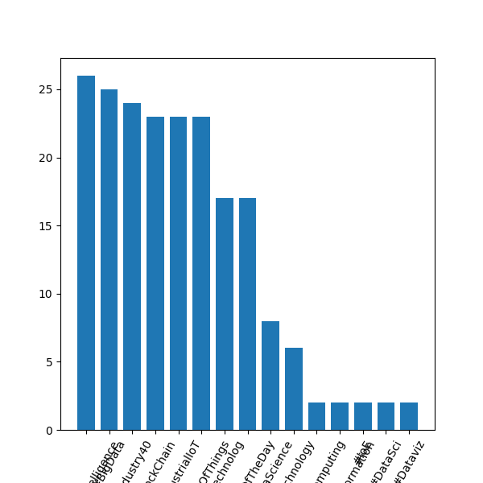
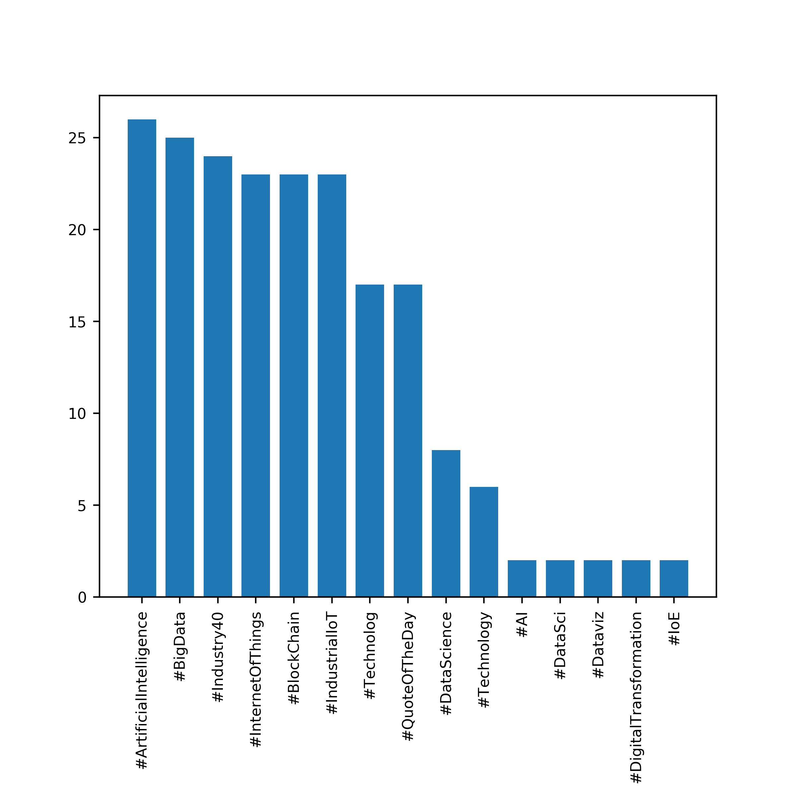
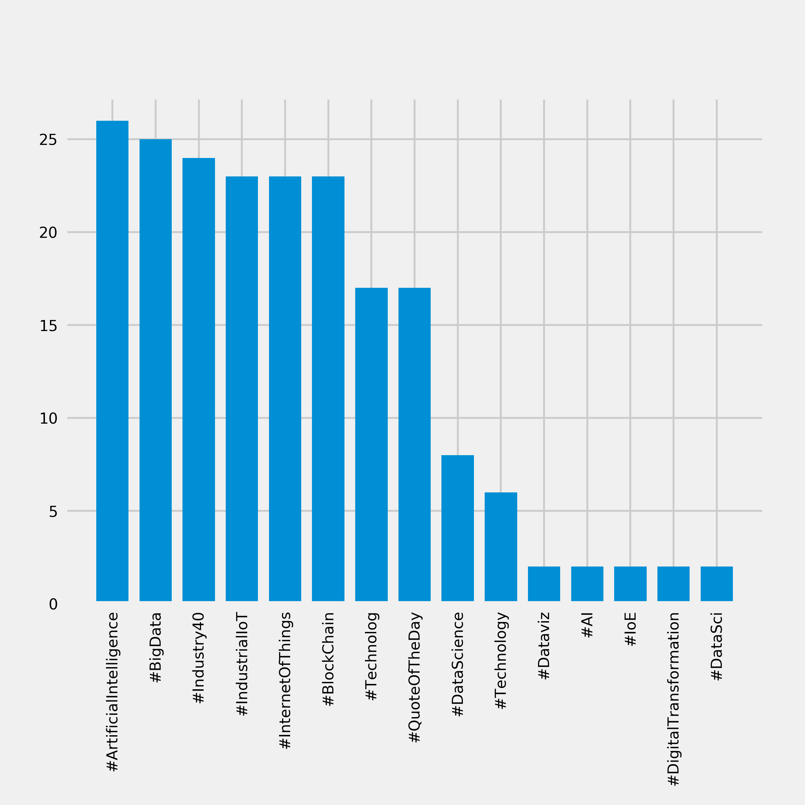
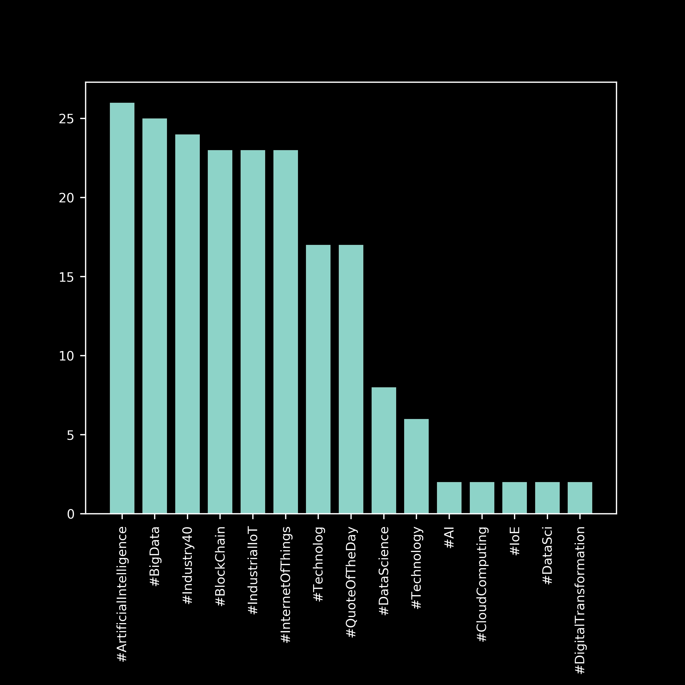
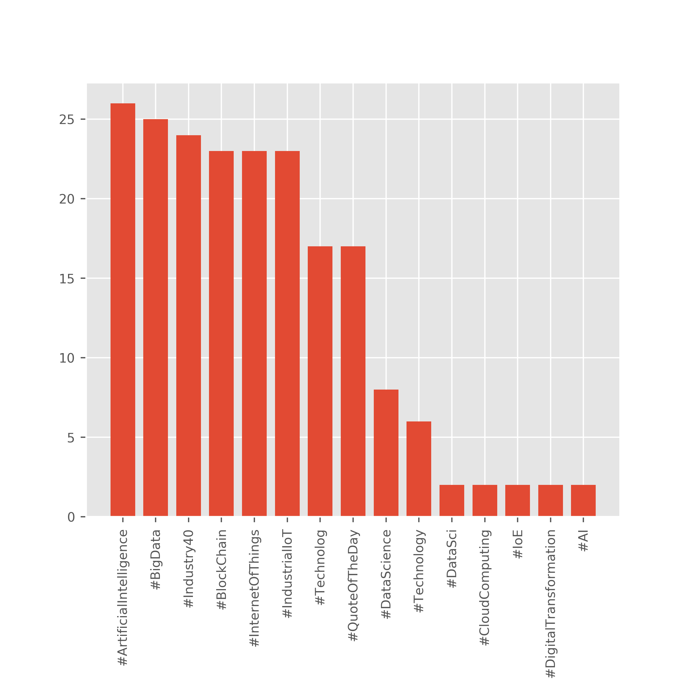
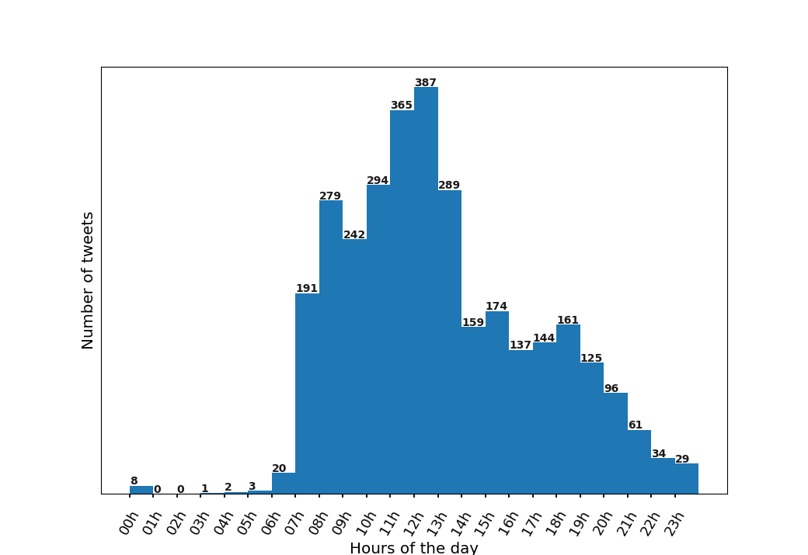
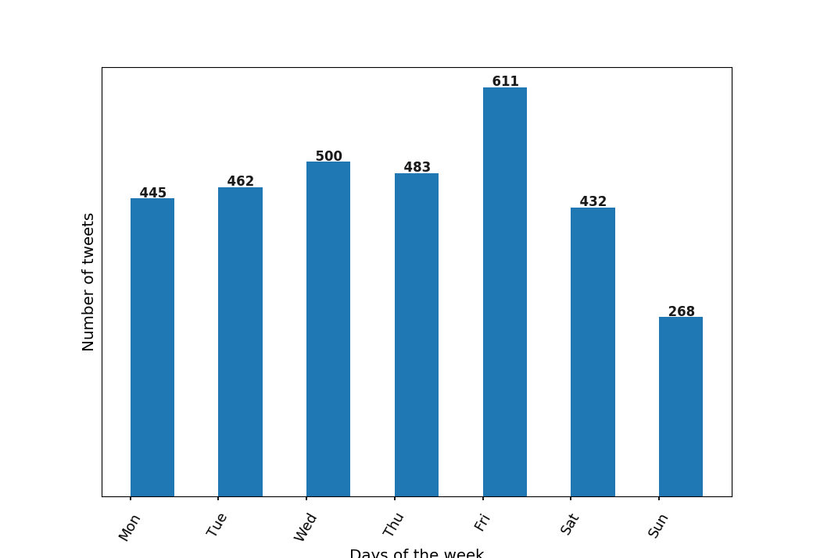
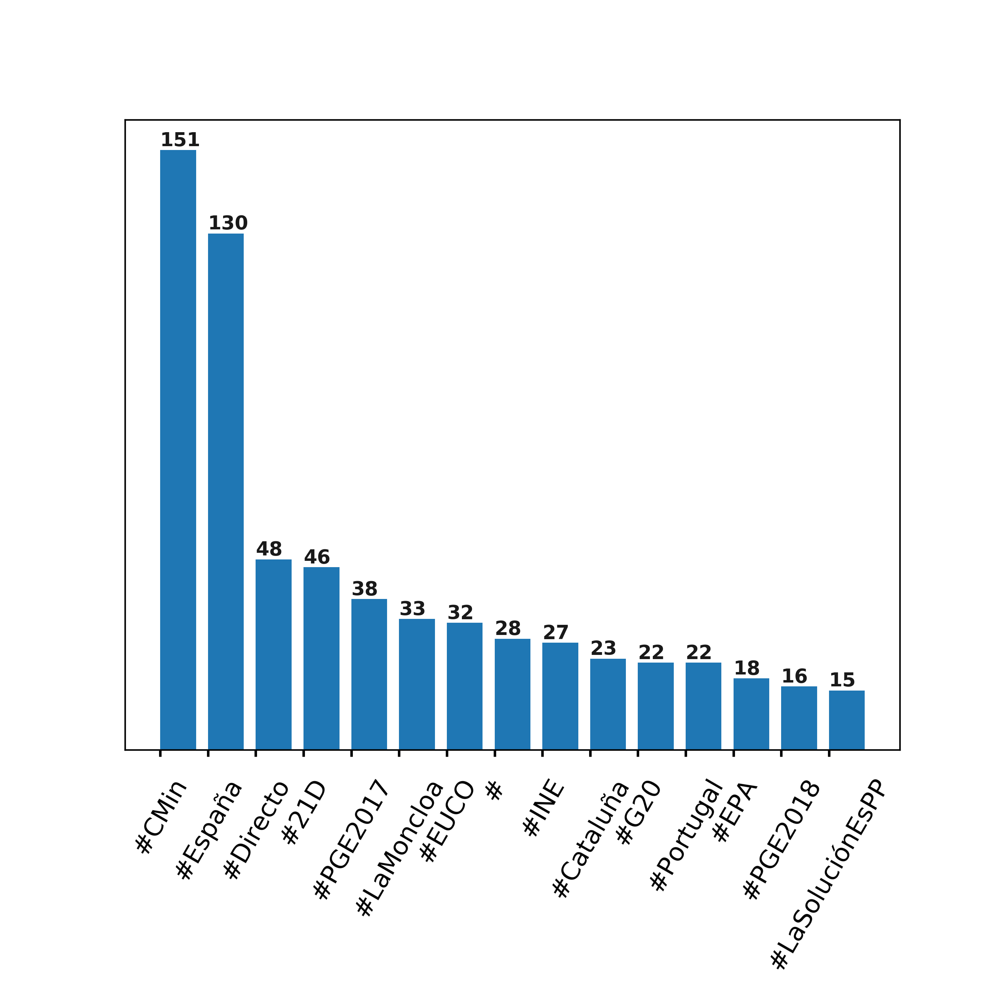

# CLOUD-COMPUTING-CLASS-2018
 
* Sergio Ruiz: __sergiers@opendeusto.es__
* Dagoberto Herrera: __dagobertoherreramurillo@live.com__

# Pre tasks
For this Lab, we are going to reuse the `Access.py` class, in order to access twitter via PIN-code. 
We are also going to make a small  modification: we are going to join the `consumer_key` and `consumer_secret`
tokens in this class, so all our "door" to access Twitter is abstracted in one class.

We can then access this credentials by calling the variables of the class:

``` 
#Instance Access object and follow the PIN process
access = Access.obj

consumer_key = access.consumer_key
consumer_secret = access.consumer_secret
access_token = access.atk
access_secret = access.ats
```


# Task 3.1: Real-time tweets API of Twitter
Following the instructions of the lab, we have created the class `TwitterListener` that contains the Stream Listener. This class is storing tweets into a Json called _ArtificialIntelligenceTweets.json_ which contains tweets related with the _ArtificialIntelligence_ topic.
If then in a terminal we check the amount of tweets, we got this:

```
$ wc -l ArtificialIntelligenceTweets.json 
16 ArtificialIntelligenceTweets.json
```

This class will never stop, until we kill it, so we can work in the next step, analyzing those tweets.

# Task 3.2: Analyzing tweets - Counting terms
Now the listener is built an running. Meanwhile, we are going to build the `TwitterAnalyzer.py` that will analyze this tweets. In this case, we want to count the most frequent terms. Here are some examples of the content of those tweets: 

We created the file `CaseStudy.py` to do this section: 

Top 10 tokens:

```
: : 52
… : 48
RT : 42
#ArtificialIntelligence : 25
. : 22
the : 21
and : 19
of : 17
The : 17
Rise : 16
```

Top 10 hashtags:

```
#ArtificialIntelligence : 25
#Cognitivecomp : 15
#bot : 15
#AI : 11
#IndustriaIn : 8
#BigData : 5
#Hadoop : 4
#DeepLearning : 4
# : 3
#artificialintelligence : 3
```

Top 10 most frequent terms, skipping mentions and hashtags:

```
… : 48
The : 17
Rise : 16
human : 15
https://t.co/ed0n4Q5z6d : 15
insurance : 8
Help : 8
privacy : 8
Security : 8
data : 8
```

# Task 3.3: Case study

Normally when we want to analyze data, a graph is the best way to see the data. For this, we can use the `matplotlib` library to generate plots.

The following plot was generated with the dataset generated by you in the previous task:

__Default plot:__



But of course, we can tune a bit this plots in order to have a more visual graph. We took a look to the `matplotlib` use this configuration:

```
# Set the style globally
# Alternatives include bmh, fivethirtyeight, ggplot,
# dark_background, seaborn-deep, etc

plt.rcParams['font.serif'] = 'Ubuntu'
plt.rcParams['font.monospace'] = 'Ubuntu Mono'
plt.rcParams['font.size'] = 9
plt.rcParams['axes.labelsize'] = 10
plt.rcParams['axes.labelweight'] = 'bold'
plt.rcParams['axes.titlesize'] = 10
plt.rcParams['xtick.labelsize'] = 8
plt.rcParams['ytick.labelsize'] = 8
plt.rcParams['legend.fontsize'] = 10
plt.rcParams['figure.titlesize'] = 12

# Set an aspect ratio
width, height = plt.figaspect(1)
fig = plt.figure(figsize=(width,height), dpi=400)

```

__The plot we got is this:__




This is a bit better, but seems to be too standard. In order to keep tunning this, we can use the integrated styles to play with the style:


```
plt.style.use('ggplot')
```
```
plt.style.use('seaborn-pastel')
```
```
plt.style.use('fivethirtyeight')
```
```
plt.style.use('dark_background')
```

__fivethirtyeight:__



__seaborn-pastel:__


__dark_background:__



__ggplot:__




As we can see, because the labels on the X axis are quite large, we have to rotate them 90º. Doing this is ok, but we will have to consider to use an [horizontal histogram](https://matplotlib.org/gallery/lines_bars_and_markers/barh.html) instead of the normal one. 

# Task 3.4: Student proposal

Now, we propose to analyze the frequency in which Mr. Mariano Rajoy tweets. We call this section _"When does mariano has free time"_.

First of all, we created the Python file `StudenProposalListener.py`. In this file, as in the past, we first use our Twitter PIN-code authentication. We now want to store as much tweets as possible. There is one restriction in twitter API: Twitter only allows access to a users most recent 3240 tweets with this method. Thanks to [yanofskyk](https://gist.github.com/yanofsky/5436496) for teach us how to retrieve the tweets!
We have to take in consideration one thing: We MUST put a line break between Json's in order to avoid the reader crash. We can do this by adding a line breaker:

```
# write tweet objects to JSON
with open('tweet.json', 'w') as outfile:
    for status in alltweets:
        json.dump(status._json, outfile)
        # IMPORTANT: write line break in order to avoid python to crash when read
        outfile.write('\n')
```

Now, we are ready to execute our script:


```
URL for obtaining the pincode is: https://api.twitter.com/oauth/authorize?oauth_token=K1-oHQAAAAAAToKjAAABYkgccsI

Copy/Paste the pincode from the web browser: 2460174
...400 tweets downloaded so far
...600 tweets downloaded so far
...800 tweets downloaded so far
...1000 tweets downloaded so far
...1200 tweets downloaded so far
...1400 tweets downloaded so far
...1600 tweets downloaded so far
...1800 tweets downloaded so far
...2000 tweets downloaded so far
...2200 tweets downloaded so far
...2400 tweets downloaded so far
...2600 tweets downloaded so far
...2800 tweets downloaded so far
...3000 tweets downloaded so far
...3200 tweets downloaded so far
...3201 tweets downloaded so far
...3201 tweets downloaded so far
Done

Process finished with exit code 0
```

Finish!. Next part is to analyze this content. We are going to know at what times does Mariano tweet and in which days of the week. We created two very similar python file's, calle `StudentProposalDay.py` and `StudentProposalWeek.py`. In this files, we first read our Json file:

``` 
with open(fname, 'r') as f:
    count_all = Counter()
    for line in f:
        tweet = json.loads(line)

        #get posted date:
        datesR.append(tweet["created_at"])

        # get the content of the tweet :
        content.append(tweet["text"])
```

We store the content into a list of dates, by reading the atribute `"created_at"` in the Json. This date format is very ugly:

`"Wed Mar 14 13:03:41 +0000 2018"`

But no worries. We parse it easily by calling `datetime.strptime()`:

`datetime_object = datetime.strptime(d, '%a %b %d %H:%M:%S +0000 %Y')`

We get from this date the hours of the tweets (we just want to know `int` numbers)

Finally, we create a histogram showing the data. For doing this, we want to create a more beautiful and handsome plot. So we are going to do some changes to the default style of the graph:

1. We select the style. We open a python console an execute the bellow two commands, in order to know which styles are available. Our favorite was `seaborn-talk`.
2. We create the plt object, and we set the width of the bar to 1 (full size):
`plt.bar(xNames,hours, 1, align='edge',)`
3. We remove the Y axis labels, to clean the graph:
`plt.yticks([])`
4. Finally, because we just removed the Y axis measures, we print them directly in the bars of the graph:
```
#Print the number of tweets in each bar
for a,b in zip(xNames, hours):
    plt.text(a, b+1, str(b), color='black', fontweight='bold', fontsize=10, alpha=0.9)
```

These are the commands for obtain the styles available:
```
>>> import matplotlib.pyplot as plt
>>> print(plt.style.available)
```
 
 The result now looks much beautiful:
 
 __Daily tweets:__




__Weekly tweetst:__


 
 
 And we also see the most used hashtags. This graph is made by the Python file `StudentProposal.py`:
 
 __Most used hashtagst:__


 
# Conclusion:
Plots are the best way to make conclusions. In the case of the hashtags, we can see the diferences in the number of tweets between the first two ones and the others. We also conclude that Mariano tweets more at 11:00 and 12:00 (when normally in spain, people have the piscolabis breaks) and in fridays: [Is Mariano Rajoy giving us bad news?](http://cadenaser.com/ser/2012/07/29/sociedad/1343528007_850215.html) :stuck_out_tongue_winking_eye:
 
 
